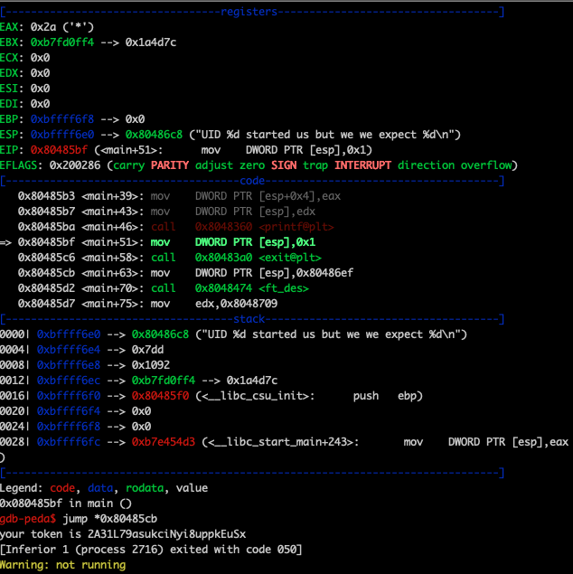

## Démarche
- Dans le home : `ls -la`
  > -rwsr-sr-x 1 flag13  level13 7303 Aug 30  2015 level13

- Analyse du fonctionnement du binaire :
  - `./level13` :
      > UID 2013 started us but we we expect 4242 

  - `cat /etc/passwd` :
    > level13:x:2013:2013::/home/user/level13:/bin/bash

  - `nm -u level13` :
      ```
      U exit@@GLIBC_2.0
      U getuid@@GLIBC_2.0
      U printf@@GLIBC_2.0
      U strdup@@GLIBC_2.0 
      ```

  - `strings level13` :
      ```
      0123456
      UID %d started us but we we expect %d
      boe]!ai0FB@.:|L6l@A?>qJ}I
      your token is %s
      ```
    
  - Le programme semble récupérer l'uid de l'utilisateur puis faire un premier printf (`UID %d started us but we we expect %d`) avant d'exit.
  - Une seconde string est affichée (`your token is %s`)

- Exploitation avec GDB + peda :

  - `scp -P 4242 -r ~/peda/ level13@192.168.0.17:/tmp`
  - `gdb level13`
  - Dans gdb :
    - Activer l'utilisation de peda : 
  
        `source /tmp/peda/peda.py`
    - Ajouter un breakpoint au début du de la fonction main (adresse récupérée avec `nm level13`) :
        
         `br *0x0804858c`
    - Lancer le programme : `run` 
    - Continuer son exécution étape par étape en utilisant `n` jusqu'à la commande avant le exit (`call   0x80483a0 <exit@plt>`)
    - Sauter l'appel à exit :
        
        `jump *0x80485cb` 
        
        (`0x80485cb <main+63>:	mov    DWORD PTR [esp],0x80486ef` soit l'instruction APRES l'appel à exit)
    
    - Récupérer le token sur la sortie standard
      > your token is 2A31L79asukciNyi8uppkEuSx 


      > 


## Ressources
- [Peda](https://github.com/longld/peda)
- [Assembleur - Notions de base](https://beta.hackndo.com/assembly-basics/)